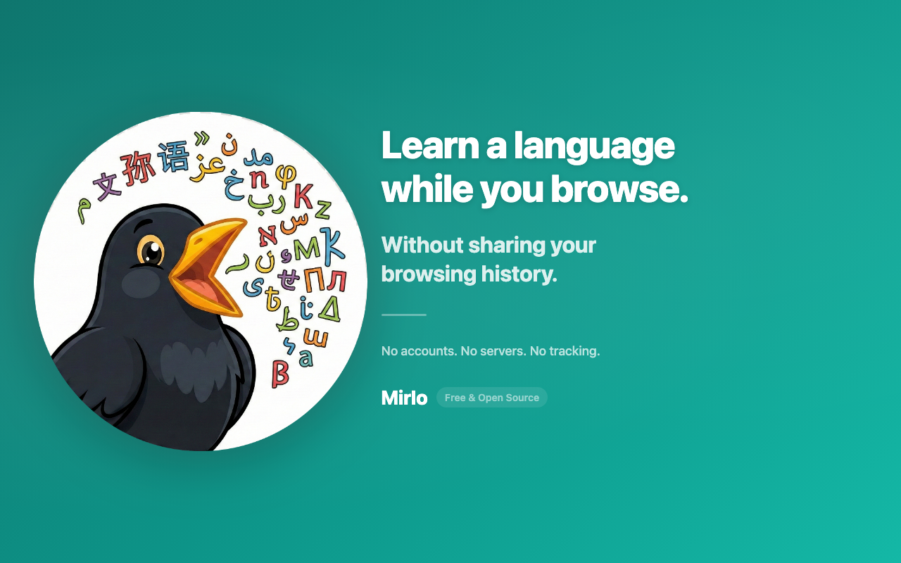
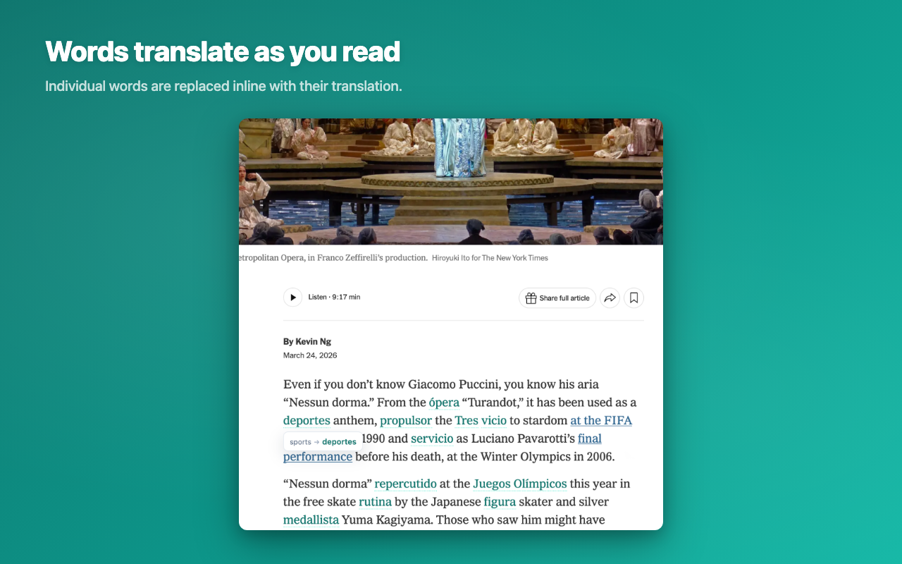
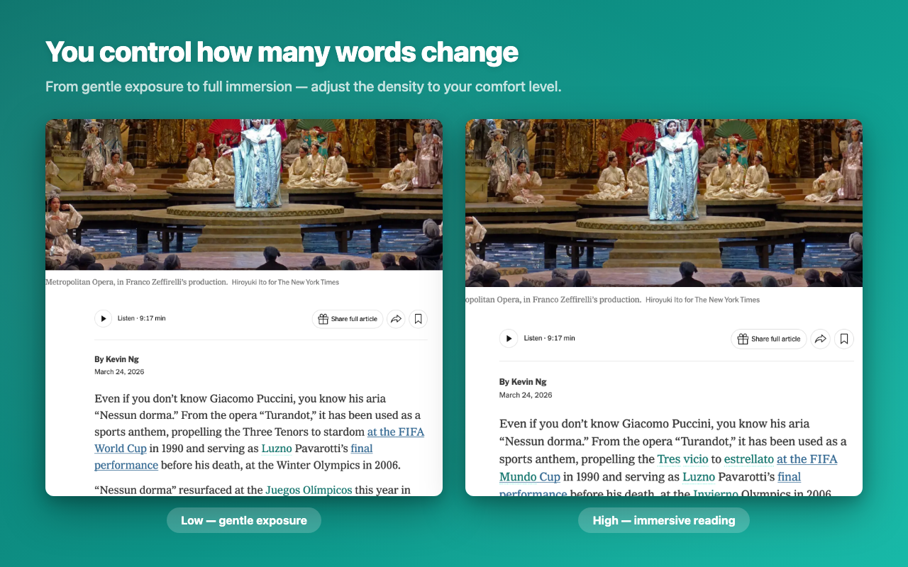

# Mirlo

**Learn a language while you browse. Everything happens on your device.**

<p align="center">
  
</p>

Mirlo is a Chrome extension that replaces words on web pages with translations in the language you're trying to learn. You read normally and pick up words as you go. Hover any translated word to see the original.

All translation runs locally using Chrome's built-in Translator API. No servers, no accounts, no data collection.

## Install

[**Get Mirlo from the Chrome Web Store**](https://chromewebstore.google.com/detail/mirlo-%E2%80%94-language-learning/bolaihmnmcaedodmcempenkddbkolaih)

## How It Works

When Mirlo is active on a page, it scans for readable paragraphs, picks individual words based on your density setting, and replaces them with translations in the language you're learning. The translated words appear inline — colored text with a dotted underline. Hover one to see the original.

<p align="center">
  
</p>

The density control sets the intensity: Low replaces about 1 in 12 words (gentle exposure), Medium about 1 in 4 (default), High about 1 in 2 (heavy exposure). For full paragraph context, click the bird badge that appears when you hover over a paragraph.

<p align="center">
  
</p>

Language detection runs per-paragraph, so mixed-language pages translate correctly in each direction.

## On-Device Translation

Every other word-level translation extension sends your text to a server — that's why they require accounts, collect data, and ship long privacy policies.

Chrome's Translator API runs on-device, and Mirlo is built on it. No server means no account to create and no data to collect. The code is open source; read it yourself.

## Supported Languages

- English ↔ Spanish
- English ↔ French
- English ↔ German

Starting with languages that work reliably with Chrome's on-device translation. More as Chrome expands API support.

## Requirements

- Chrome 138+ on desktop
- ~22 GB disk space and 16 GB RAM for the Translator API language models

## Quick Start (Development)

```bash
npm install
npm run dev        # WXT dev server with HMR
npm test           # Run Vitest tests
npm run build      # Production build
```

Or load the built extension manually: Chrome → `chrome://extensions` → Developer mode → Load unpacked → select `.output/chrome-mv3/`.

## Documentation

- [Development Guide](docs/START_HERE.md)
- [Contributing](CONTRIBUTING.md)
- [Privacy Policy](https://www.boxcars.ai/mirlo-privacy-policy/)

## License

[MIT](LICENSE)

---

Free. Open source. No premium tier. No ads. No upsells.
